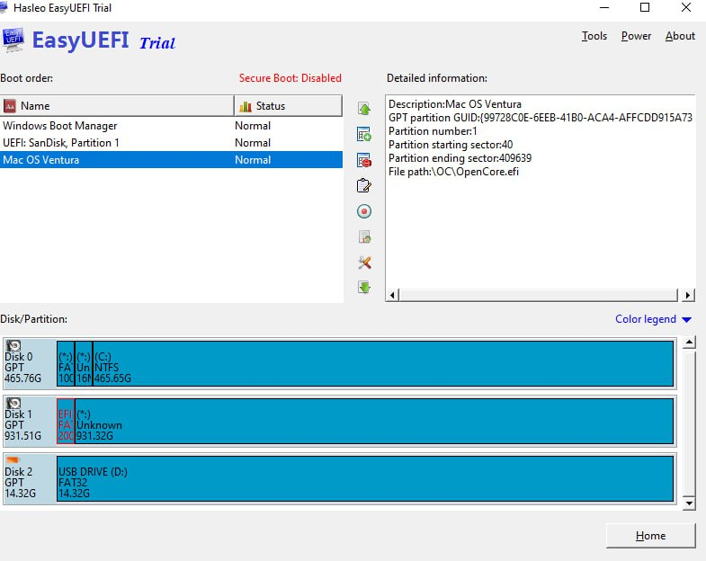

<!-- @format -->

# HACKINTOSH GUIDE 👨🏻‍💻 ⌨️ 🍎 🖥️

ℹ️ [MAIN GUIDE](https://dortania.github.io/OpenCore-Install-Guide/prerequisites.html)

🔥 in this guide using OpenCore debug boilerplate, check out ⤵️

ℹ️ [Debug boilerplate](https://github.com/acidanthera/OpenCorePkg/releases/)

ℹ️ [DISCORD SUPPORT](https://discord.com/invite/2QYd7ZT)

❗️ After all the preparations, you may want to speed up loading and hide all messages for debugging, for this refer to this [guide](https://dortania.github.io/OpenCore-Post-Install/cosmetic/verbose.html#macos-decluttering)

❗️ This guide does not explain installing mac os or creating a usb to do this, please refer to the relevant manual:
💎 [Creating USB](https://dortania.github.io/OpenCore-Install-Guide/installer-guide/#creating-the-usb)

❗️ After installation, make sure you have completed everything in this guide.
https://dortania.github.io/OpenCore-Post-Install

❗️ If there are problems with the bootloader for example you have Windows on a separate disk as some BIOSes tend to prevent booting from it if they detect EFI/Microsoft/Boot/bootmgfw.efi I would advise making a custom entry in your BIOS that points directly to EFI/OC/OpenCore.efi. I'm suspecting your BIOS is blocking access to EFI/BOOT/BOOTx64.EFI due to EFI/Microsoft/Boot/bootmgfw.efi being found. To do this you can use
https://www.easyuefi.com/index-us.html

    It might look like this ⤵️

❗️ Requirements:

- Ventura 13.6 and newer
- BIOS F11

## FOLDER STRUCTURE 📂

The file and folder structure looks something like this ⤵️

    ├── EFI
    │   ├── BOOT
    │   └── OC
    │       ├── ACPI
    │       ├── Drivers
    │       ├── Kexts
    │       │   ├── IntelMausi.kext
    │       │   │   └── Contents
    │       │   │       └── MacOS
    │       │   ├── Lilu.kext
    │       │   │   └── Contents
    │       │   │       └── MacOS
    │       │   ├── USBToolBox.kext
    │       │   │   └── Contents
    │       │   │       └── MacOS
    │       │   ├── UTBMap.kext
    │       │   │   └── Contents
    │       │   ├── VirtualSMC.kext
    │       │   │   └── Contents
    │       │   │       └── MacOS
    │       │   └── WhateverGreen.kext
    │       │       └── Contents
    │       │           └── MacOS
    │       ├── Resources
    │       │   ├── Audio
    │       │   ├── Font
    │       │   ├── Image
    │       │   └── Label
    │       └── Tools
    ├── SSDTs
    │   ├── SSDTTime  SSDTs
    │   │   ├── SSDT-EC-USBX
    │   │   ├── SSDT-PLUG
    │   │   └── SSDT-PMC
    │   ├── manual SSDTs
    │   │   ├── edited
    │   │   └── src
    │   └── ready SSDTs
    └── screenshots

**EFI: base files for booting from USB**

**SSDTs: experements and setup**

## SPECS ⚙️

**MOTHERBOARD:**

- BRAND: **Gigabyte Technology Co. Ltd.**
- MODEL: **Z390 AORUS MASTER-CF BUS**
- SPECS: **PCI-Express 3.0 (8.0 GT/s)**

**CPU:**

- NAME: **Intel Core i7 9700K**
- ARCH: **Coffee Lake SOCKET: 1151 LGA**
- INTERNAL GRAPHICS CARD: **UHD 630**

**GRAPHIC:**

- NAME: **AMD Radeon RX 580**
- MEMORY SIZE: **8GB**

**STORAGE:**

- NAME: **Samsung SSD 970 EVO 1TB**
- TYPE: **NVMe**
- MEMORY SIZE: **1TB**

**NETWORK:**

- MAC address: **B4:2E:99:FB:0B:B1**
- NIC: **Intel(R) Ethernet Connection (7) 1219-V**

**APPLE:**

- TYPE: iMac19,1 Serial: **C02C10FKJV3Q**
- BOARD SERIAL: **C02953310QXLNV9JC**
- SMUUID: **BAB10EE3-7D31-436F-B636-641F22E0E132**
- APPLE ROM: **C42C0358819B**

## BIOS SETTINGS ⌨️

[RECOMMENDED SETTINGS](https://dortania.github.io/OpenCore-Install-Guide/config.plist/coffee-lake.html#intel-bios-settings)

**#Disable**

- Fast Boot
- Secure Boot
- Serial/COM Port
- Parallel Port
- Compatibility Support Module (CSM)
- Thunderbolt (For initial install, as Thunderbolt can cause issues if not setup correctly)
- Intel SGX
- Intel Platform Trust
- CFG Lock

**#Enable**

- VT-d
- Above 4G Decoding
- Hyper-Threading
- Execute Disable Bit
- EHCI/XHCI Hand-off
- OS type: Windows 8.1/10 UEFI Mode (some motherboards may require "Other OS" instead)
- DVMT Pre-Allocated (iGPU Memory): 64MB or higher \*
- SATA Mode: AHCI

**\*FYI** if DVMT Pre-Allocated (iGPU Memory) is not visible try to roll back to the optimal settings **load optimized defaults**, then reboot and set **internal graphic = enabled**, reboot and voila

## TOOLS 🔧

For work with **.plist** files
https://github.com/corpnewt/ProperTree

SMBIOS
https://github.com/corpnewt/GenSMBIOS

USB mapping on Mac
https://github.com/corpnewt/USBMap

USB mapping on Windows (better option)
https://github.com/USBToolBox/tool

Hackintool
https://github.com/benbaker76/Hackintool

IORegistryExplorer
https://github.com/khronokernel/IORegistryClone/blob/master/ioreg-302.zip

[Compiling and decompiling ACPI Tables](https://dortania.github.io/Getting-Started-With-ACPI/Manual/compile.html#compiling-and-decompiling-acpi-tables)

## KEXTS 📦

**SOUND**
https://github.com/acidanthera/AppleALC

- AppleALC.kext

**BLUETOOTH**
https://github.com/OpenIntelWireless/IntelBluetoothFirmware/releases

- IntelBluetoothFirmware.kext
- IntelBTPatcher.kext

**WIFI**
https://github.com/OpenIntelWireless/itlwm/releases/tag/v2.2.0

- itlwm.kext

**SENSORS / TEMPERATURE**
https://github.com/Acidanthera/VirtualSMC/releases/tag/1.3.2

- SMCProcessor.kext
- SMCSuperIO.kext

## APPLICATIONS 👨🏻‍💻

**TEMPERATURE dGPU**
https://github.com/ChefKissInc/RadeonSensor

**WIFI**
https://github.com/OpenIntelWireless/HeliPort/releases

**MONITOR CONTROL** https://github.com/MonitorControl/MonitorControl/releases